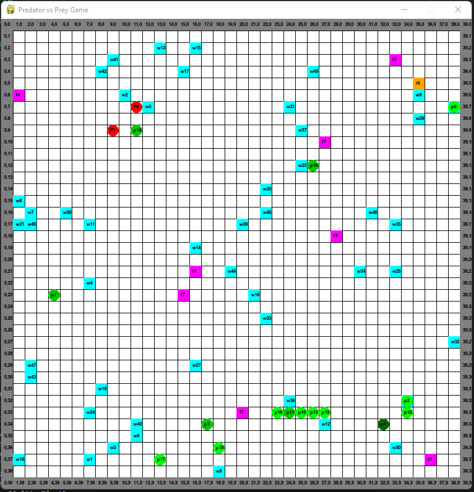

# Predator vs Prey Game

Simple simulation of Predators vs Preys using Python.

## Entities:

Creatures:
- Predator: eats the prey (+10);
- Prey: eats food (+5), get reward (+50) when closer, and run away from the predator;

Objects:
- Wall: obstacle to punish and prevent creatures from crossing over (-100);
- River: walkable tile that punishes all creatures (-10);
- Food: walkable tile that reward preys (+5);
- Reward: walkable tile that reward preys (+50) plus a random reward;

## Premises:

- Predator will always look for the closest preys;
- Preys will always look for the closest food;
- If a prey encounter a reward closer than the food, it will look for it instead;
- If a prey encounter a predator closer than 4 tiles, it will run away from it;
- When running away, it is possible that the prey will collide with the walls;
  - In case of collision with walls, the prey is punished, get re-spawned and it's color change;

## Scaffolding

```sh
- src
  - constants: main constants over the projects;
  - helpers: shareable toolset;
  - seeders: create the entities on memory;
  - states: store the current state of the game;
  - game: engine that run the game;
  - objects: entities that represent an object;
  - creatures: entities that represent a creature + behaviour logic;
```

## Requirements

This project requires Python 3.9.

If you don't have Python installed, you can download it from the [official Python website](https://www.python.org/downloads/) and follow the installation instructions for your operating system.

## Installation

1. Clone the repository:

   ```sh
   git clone https://github.com/shakkurcwb/PredatorPreyGame
   ```

2. Navigate to project repository:

    ```sh
    cd PredatorPreyGame
    ```

3. Install Python dependencies using Pip:

    ```bash
    pip install -r requirements.txt
    ```

## License

This project is licensed under the MIT License.

## Picture


